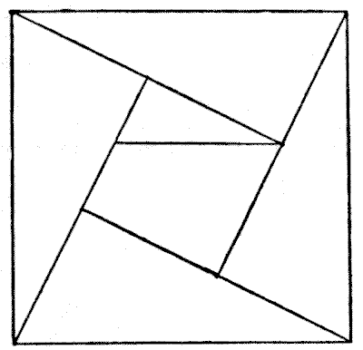

# pilum • [](https://github.com/abigger87/pilum/actions/workflows/tests.yml) [](https://github.com/abigger87/pilum/actions/workflows/publish.yml)   

Lightweight, Modern Typescript Library for **[Multicall3](https://github.com/mds1/multicall)** published on [npm](https://www.npmjs.com/package/pilum).

Multicall3 flexibly aggregates results from multiple smart contract function calls. By allowing the caller to specify an additional parameter per call (a boolean for if the call should be required to succeed), the call results _can_ be aggregated gracefully on a per-call basis.

Since calls are bundled as a single JSON-RPC request to the Multicall3 contract, this dramatically reduces the load on RPC servers, especially important for remote hosts like Infura and Alchemy. Additionally, packing calls in one request causes the calls to be executed in the same block, with the block number returned so potential responses from outdated RPC nodes may be ignored.

By default, the deployed [Multicall3](https://github.com/mds1/multicall/blob/master/src/Multicall3.sol) contract is used. This can be overridden, see [Custom-Multicall-Contracts](#Custom-Multicall-Contracts). **But**, [Multicall3](https://github.com/mds1/multicall/blob/master/src/Multicall3.sol) is **highly recommendeded** (more details below).

Multicall aggregators and executors are statically overloaded to allow for zero-config execution. Meaning, you can execute calls using Multicall with **zero overhead** except your calls. Although this is not recommended due to its rpc-unreliability, we demonstrate it [here](#Zero-Config-Execution).

To further explore using `pilum`, please check out our [Usage](#Usage) docs or dive right into our [examples](./examples).


## Installation

```sh
npm install pilum
# OR
yarn add pilum
```


## Usage

Importing in ES6 Javascript / TypeScript:
```js
import { Multicall } from 'pilum';
```

Since `pilum` makes an RPC call to a Multicall contract, we need to use a provider. It's highly recommended that you specify a provider, rather than rely on [ethers](https://docs.ethers.io/v5/)'s default provider (which is what `pilum` uses under the hood for the [zero config execution](#Zero-Config-Execution)).

**Recommended Usage** (using a custom provider)

```js
import { ethers } from 'ethers';
import { Multicall } from 'pilum';

// Create a custom provider
const provider = new ethers.providers.JsonRpcProvider(
  "https://mainnet.infura.io/v3/<YOUR-INFURA-API-KEY>" // Example RPC URL
);

// Craft the Multicall Instance
const multicall = new Multicall({
  provider: provider
});

// Define our calls
const calls = [
  {
    reference: 'multicall3',
    contractAddress: '0xcA11bde05977b3631167028862bE2a173976CA11',
    abi: [ { name: 'getBlockNumber', type: 'function', stateMutability: 'view', inputs: [], outputs: [ { name: 'blockNumber', type: 'uint256' }] } ],
    calls: [{ reference: 'blockNumCall', method: 'getBlockNumber', params: [], value: 0 }]
  }
];

// Call the Multicall associated functions directly
const { results } = await Multicall.call(calls);

// Print the call result
console.log(results);
```


#### Zero Config Execution

**Not Recommended** (due to RPC unreliability).

```js
import { ethers } from 'ethers';
import { Multicall } from 'pilum';

// Define our calls
const calls = [
  {
    reference: 'multicall3',
    contractAddress: '0xcA11bde05977b3631167028862bE2a173976CA11',
    abi: [ { name: 'getBlockNumber', type: 'function', stateMutability: 'view', inputs: [], outputs: [ { name: 'blockNumber', type: 'uint256' }] } ],
    calls: [{ reference: 'blockNumCall', method: 'getBlockNumber', params: [], value: 0 }]
  }
];

// Call the Multicall associated functions directly with zero overhead
const { results } = await Multicall.call(calls);

// Print the call result
console.log(results);
```


#### Custom Multicall Contracts

By default, the deployed [Multicall3](https://github.com/mds1/multicall/blob/master/src/Multicall3.sol) contract is used. This can be overridden by specifying the `address` parameter in the constructor like so:

```typescript
const multicall = new Multicall({
  address: '0xcA11bde05977b3631167028862bE2a173976CA11',
});
```

But, [Multicall3](https://github.com/mds1/multicall/blob/master/src/Multicall3.sol) is **highly recommendeded**. It's ABI is backwards compatible with Multicall and Multicall2, but it's cheaper to use (so you can fit more calls into a single request), and it adds an `aggregate3` method so you can specify whether calls are allowed to fail on a per-call basis. Additionally, it's deployed on every network at the same address.


#### Alternate Networks

By default, `pilum` uses Ethereum mainnet. You can specify a different network by passing a `network` parameter (the chain(network) id) to the constructor like so:

```typescript
const multicall = new Multicall({
  network: 4,
});
```

Multicall, Multicall2, and Multicall3 deployments are supported across all networks listed in the [Multicall3](https://github.com/mds1/multicall) repository.


#### Examples

There are numerous examples demonstrating how to use `pilum`'s `Multicall` in the [examples](./examples/) directory.


## Development

Any and all pull requests are welcome and highly appreciated!

**Repository Blueprint**

```ml
examples
├─ uniquery — Minimal Queries for Uniswap pool statistics
├─ compquery — Multicalled Compound Protocol Math Queries
src
├─ abis/ — Multicall Contract ABIs
├─ models/ — Multicall Class Argument and Response Types
├─ networks/ — Network Configurations and their respective Multicall Contract Deployment Addresses
├─ index.ts — "Package Re-exports"
├─ Multicall.ts — "The Multicall Contract"
tests
└─ Multicall.test.ts — "Multicall Tests"
```


## License

[AGPL-3.0-only](https://github.com/abigger87/pilum/blob/master/LICENSE)


## Acknowledgements

- [Multicall3](https://github.com/mds1/multicall)
- [ethereum-multicall](https://github.com/joshstevens19/ethereum-multicall)
- [Multicall.js](https://github.com/makerdao/multicall.js)
- [0xSequence's Multicall Library](https://github.com/0xsequence/sequence.js)
- [snapshot.js](https://github.com/snapshot-labs/snapshot.js)
- [MakerDAO's Multicall](https://github.com/makerdao/multicall)
- [Reducing NPM Package Size](https://glebbahmutov.com/blog/smaller-published-NPM-modules/)


## Disclaimer

_This library is provided as is. No guarantee, representation or warranty is being made, express or implied, as to the safety or correctness of the user interface or library code. None of the content present here has been audited and as such there can be no assurance it will work as intended, and users may experience delays, failures, errors, omissions, loss of transmitted information or loss of funds. The creators are not liable for any of the foregoing. Users should proceed with caution and use at their own risk._
